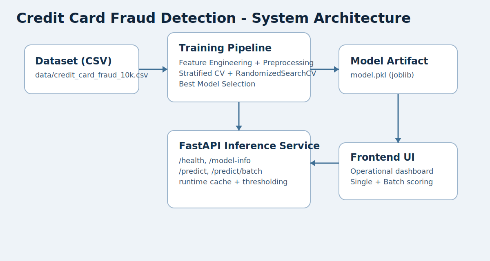
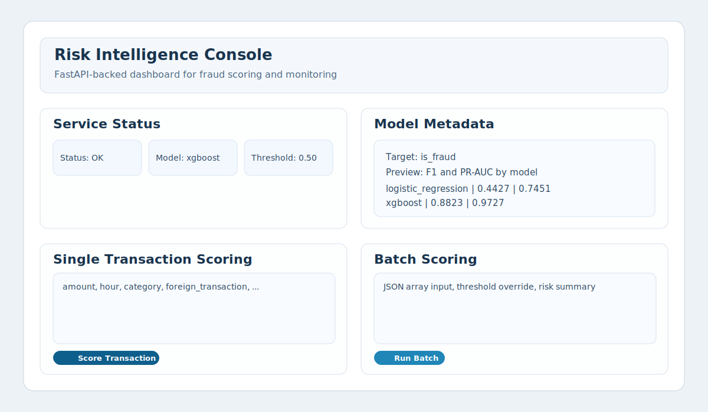

# Credit Card Fraud Detection System

Production-focused fraud detection project with feature engineering, model benchmarking, threshold tuning, and a FastAPI inference service.



## UI Preview



## Key Features

- Behavioral and temporal feature engineering
- Stratified cross-validation with hyperparameter search
- Benchmarking across multiple models (Logistic Regression, Random Forest, HistGradientBoosting, MLP, Voting Ensemble, XGBoost)
- Threshold tuning by F1 score or business cost
- Batch and single-transaction inference API
- Modular code structure with unit tests

## Project Structure

```text
ml_project/
|-- app.py
|-- requirements.txt
|-- model.pkl
|-- data/
|-- frontend/
|-- src/
|   |-- api/
|   |-- preprocessing.py
|   |-- train.py
|   |-- evaluate.py
|   |-- threshold_tuning.py
|   |-- cost_analysis.py
|-- tests/
|-- docs/images/
```

## Requirements

- Python 3.7 or higher (Python 3.10+ recommended)
- Install dependencies:

```bash
pip install -r requirements.txt
```

Core package command:

```bash
pip install numpy pandas h5py pyarrow msgpack
```

## Quick Start

1. Create and activate a virtual environment:

```bash
python -m venv venv
# Windows
venv\Scripts\activate
```

2. Install dependencies:

```bash
pip install -r requirements.txt
```

3. Train model:

```bash
python -m src.train --data data/credit_card_fraud_10k.csv --output model.pkl
```

4. Run API:

```bash
uvicorn app:app --reload
```

5. Open dashboard:

- UI: `http://127.0.0.1:8000/ui`
- Swagger: `http://127.0.0.1:8000/docs`
- OpenAPI spec: `http://127.0.0.1:8000/api/openapi.json`

## Training Options

```bash
python -m src.train --cv-folds 5 --search-iter 20
python -m src.train --no-smote
```

## Evaluation and Tuning

Evaluate:

```bash
python -m src.evaluate --model model.pkl --data data/credit_card_fraud_10k.csv
```

Threshold tuning (F1):

```bash
python -m src.threshold_tuning --mode f1
```

Threshold tuning (cost-based):

```bash
python -m src.threshold_tuning --mode cost --fp-cost 1 --fn-cost 15
```

Cost analysis CSV:

```bash
python -m src.cost_analysis --fp-cost 1 --fn-cost 15 --output data/cost_analysis.csv
```

## API Endpoints

- `GET /health`
- `GET /model-info`
- `POST /predict`
- `POST /predict/batch`
- `POST /reload-model`

Sample `POST /predict` payload:

```json
{
  "amount": 84.47,
  "transaction_hour": 22,
  "merchant_category": "Electronics",
  "foreign_transaction": 0,
  "location_mismatch": 0,
  "device_trust_score": 66,
  "velocity_last_24h": 3,
  "cardholder_age": 40
}
```

## Tests

Run unit tests:

```bash
pytest
```
